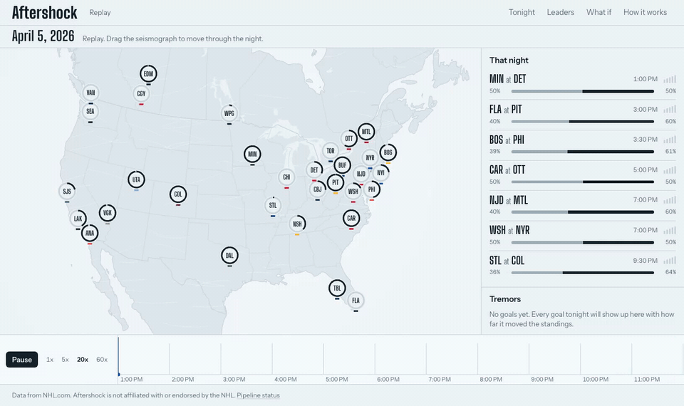
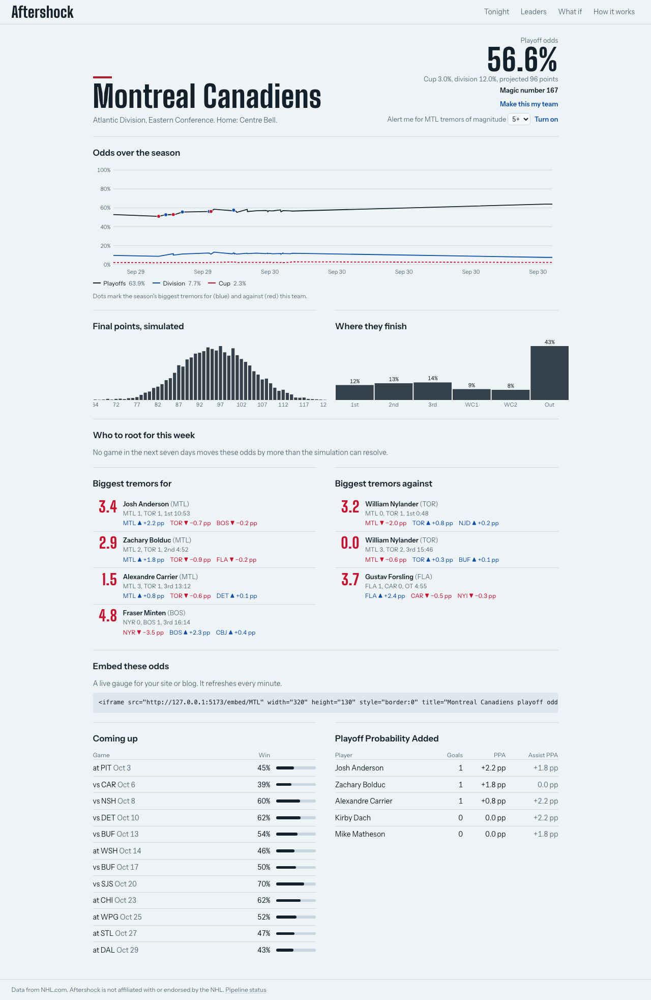
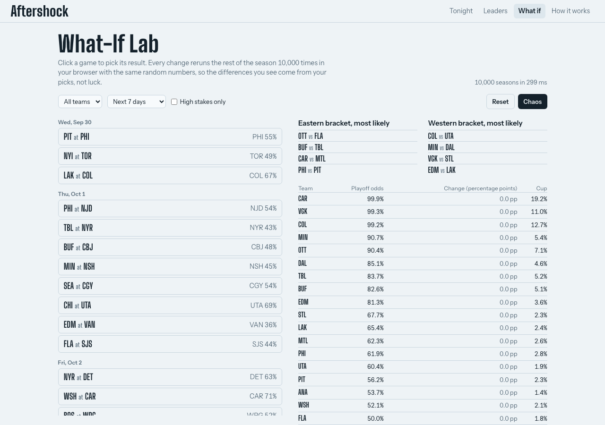
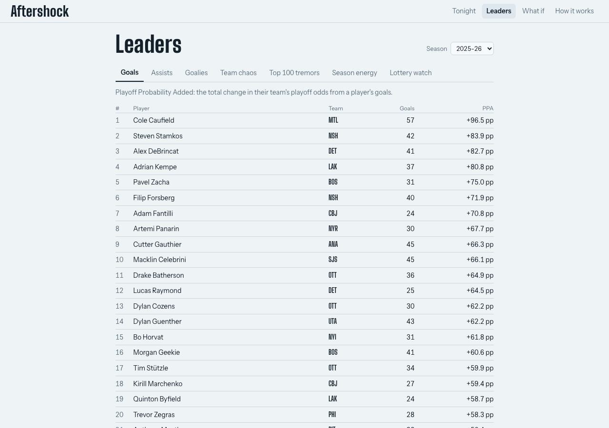
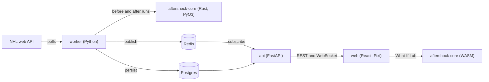

# Aftershock

**Every goal in the NHL is an earthquake. Aftershock shows how far it travels.**



A live map of North America holds all 32 arenas. When a goal is scored
anywhere in the league, a shockwave radiates out from that arena, and every
team whose playoff odds changed pulses up or down as the wave reaches it. A
seismograph along the bottom logs the night's tremors.

Under the hood: live play-by-play for every game at once, three models built
from a decade of NHL data (expected goals, team strength, in-game win
probability), and a Rust Monte Carlo simulator that reruns the rest of the
season 20,000 times after every goal. From that comes a stat hockey does not
really have: **Playoff Probability Added (PPA)**, which scores every goal by
how much it moved its team's playoff odds. There is also a What-If Lab that
reruns the season in your browser through WebAssembly, a replay of any night
from the last two seasons, shareable tremor cards, and a nightly recap.

| Team page | What-If Lab | Leaders |
|---|---|---|
|  |  |  |

## How it works

**How dangerous was each shot.** An expected-goals model scores every
unblocked shot by distance, angle, shot type, rebound, rush, manpower, empty
net, and score. It never looks at who shot or who was in goal. On the 2025-26
season, which it never saw in training, its AUC is 0.755.

**How good is each team.** Offense and defense ratings move after every game
toward how a team actually played (goals and expected goals), with recent
games counting most. From 2021-22 to 2025-26, predicting each game with only
what was known that morning, it picked the winner 59.4 percent of the time.
Good hockey models live between 58 and 62.

**Who is winning right now.** In-game win probability starts from a physical
model of goals arriving at the rates measured for the current manpower, then a
boosted model corrects it with the matchup, the power-play clock, and shots
so far. Overtime and the shootout are computed exactly.

**Rerunning the season.** A simulator written in Rust plays out every
remaining game tens of thousands of times, applies the NHL's real
tiebreakers, builds the bracket, and plays every series. The standings engine
reproduces nine seasons of official final standings exactly, including a
pulled-goalie overtime loss that the league counts as a regulation loss. It
runs 20,000 full seasons in about 120 ms on a laptop.

**Why one goal can be measured.** To isolate a goal, Aftershock runs the
season twice, once without the goal and once with it, using exactly the same
random numbers for every game. Each simulated game draws its randomness from a
fixed recipe keyed to that game and that simulation, so the only difference
between the two runs is the game where the goal happened. Without that, a
real shift of a few tenths of a percentage point would drown in noise.

**PPA and magnitude.** A goal's PPA is the change in its team's playoff odds.
Its magnitude puts the total shift across all 32 teams on a 0 to 10 scale:
the typical goal is about a 2, and a season's biggest are around 8. Early in
the season goals are small. That is correct: the map gets more violent as
April approaches.

Every number above is measured and explained in the
[methodology](docs/MODELS.md) and the [model cards](ml/MODEL_CARDS.md).

## Architecture



Live nights and replays share one code path: a live source polls the NHL API,
a replay source rebuilds what the feed showed at each moment of a finished
game, and everything downstream is identical. More in
[docs/ARCHITECTURE.md](docs/ARCHITECTURE.md).

## Quickstart

Needs Docker, Rust, [uv](https://docs.astral.sh/uv/), pnpm, and wasm-pack
(`make setup` installs what is missing).

```sh
make setup           # toolchains, Python and web dependencies, native and WASM builds
make bootstrap-lite  # load 2024-25 onward, precompute 2025-26 tremors and replays (under 2 hours)
make up              # Postgres, Redis, api, worker, and web at http://localhost:8080
```

With no game on, the home page replays the most dramatic night of the
2025-26 stretch run at 20x, with a banner that says so.

Without Docker, run Postgres 16 and Redis 7 from Homebrew
(`brew install postgresql@16 redis`), point `DATABASE_URL` and `REDIS_URL` in
`.env` at them, and use `make dev` for hot reload.

## Commands

| Command | What it does |
|---|---|
| `make dev` | api, worker, and web with hot reload |
| `make test` | Rust, Python, and web unit tests |
| `make e2e` | Playwright end-to-end tests |
| `make lint`, `make fmt` | every linter and formatter, including the em dash check |
| `make types` | regenerate TypeScript API types from the pydantic models |
| `make backfill` | every game since 2015-16 into Postgres |
| `make train` | retrain all models, write reports, rerun the season backtest |
| `make precompute SEASON=20242025` | tremors, odds history, and replays for a past season |
| `make bench` | simulator benchmarks |
| `make screenshots` | the images and GIF in this README |

## Project structure

```
crates/aftershock-core   rules, standings, tiebreakers, Monte Carlo (Rust)
crates/aftershock-py     Python bindings (PyO3)
crates/aftershock-wasm   browser build for the What-If Lab
services/aftershock      NHL client, ingest, models, live engine, API, recap
web/                     React app: map, pages, What-If Lab
config/                  teams, venues, one rules file per season
ml/                      trained artifacts, reports, model cards
infra/                   Docker Compose, Dockerfiles, nginx
docs/                    architecture, data, models, simulator, API, design, deploy
```

## Data

Data from NHL.com. Aftershock is not affiliated with or endorsed by the NHL.
It reads the league's public play-by-play feed politely (a descriptive user
agent, at most 8 requests a second, cached so finished games are never
fetched twice), never redistributes raw data, and shows teams by abbreviation
and color only, with no logos. See [docs/DATA.md](docs/DATA.md).
