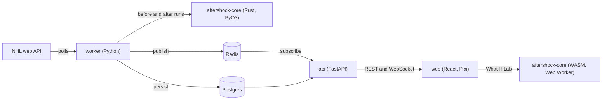

# Architecture

## Components

**NHL client** (`services/aftershock/nhl/`). A thin async client with a
global rate limit, bounded concurrency, backoff, ETag conditional requests,
and a gzipped disk cache for immutable responses. Parsers turn responses into
typed records and normalize every located event so the event owner attacks
toward x = 89. See `docs/DATA.md`.

**Ingest** (`services/aftershock/ingest/`, `jobs/backfill.py`). The fetch step
fills the raw cache (every game since 2015-16); the load step writes games,
plays (with COPY), players, and team alignments to Postgres, resumable by
season cursor.

**Models** (`services/aftershock/ml/`). Expected goals, team strength, and
in-game win probability, trained in that order because each feeds the next.
Cards and measured results: `ml/MODEL_CARDS.md`.

**Rules and simulator** (`crates/aftershock-core/`). League rules as data
(`config/leagues/*.toml`), a standings engine that reproduces nine seasons of
official final standings, and a Monte Carlo season and playoff simulator with
counter-based random numbers. Built as a Python extension (`aftershock-py`)
and as WebAssembly (`aftershock-wasm`). See `docs/SIMULATOR.md`.

**Live engine** (`services/aftershock/live/`).

- `source.py`: `LiveSource` polls the scoreboard every 30 seconds and live
  play-by-play every 5; `ReplaySource` rebuilds what the feed showed at each
  moment of a finished game. Both yield the same `Snapshot` type.
- `diff.py`: turns successive snapshots into new, changed, and removed
  events. The top-level score is the source of truth.
- `engine.py`: the I/O-free core. For each new goal it computes win
  probability just before and just after, runs a before and after simulation
  pair with the same seed, and returns a tremor. Removed goals run the pair
  in reverse; scorer changes update attribution; finals trigger full reruns.
- `worker.py`: the leader (Postgres advisory lock) that drives the engine,
  persists every effect, and publishes typed messages. Every 10 seconds it
  reweights the last run by the live games' current win probability
  (importance weights), and reruns fully when the effective sample size
  drops below half or every 5 minutes.
- `publish.py`: Redis channel `aftershock:live`, global sequence numbers, a
  1,000-message ring, and the bootstrap state under `aftershock:state`.

**Tremors** (`services/aftershock/tremors/`). Deltas, total shift, magnitude,
PPA and CPA, game stakes, and rooting guides from the simulator's conditional
tables.

**History** (`jobs/precompute.py`). Replays past seasons night by night
through the same engine with as-of information and writes tremors, odds
history, and one replay bundle per night. Magnitude is calibrated on those
tremors.

**API** (`services/aftershock/api/`). REST under `/api`, the WebSocket at
`/ws/live`, share images under `/api/og`. Wire types are pydantic models that
generate `web/src/api/types.gen.ts`. See `docs/API.md`.

**Web** (`web/`). React 19, Zustand for live state and the timeline player,
TanStack Query for REST. The map draws the basemap once with d3-geo onto a
canvas texture, animates everything in a PixiJS layer whose ticker idles when
nothing moves, and puts an accessible button over every team. Live and replay
feed the same reducer: the socket in live mode, the timeline player in demo
and replay mode.

## Data flow of one goal

1. `LiveSource` fetches the play-by-play; `GameDiffer` reports a new goal.
2. The engine advances the game-state tracker to the goal's time and scores
   win probability with the pre-goal score, then applies the goal and scores
   it again.
3. Two simulations run with the same seed: the season with the game at its
   pre-goal distribution, and with its post-goal distribution. Every other
   game sees identical random numbers, so the difference is the goal alone.
4. The worker stores the after run's odds, the tremor, and refreshes the
   PPA view, then publishes `tremor` and `odds_update`.
5. The API fans the messages out; the map flashes the venue, expands the
   ring, and updates each node as the ring passes.

## Timekeeping

All times are stored in UTC. A "hockey night" is the schedule date in
`America/New_York`. The web app shows local time.
